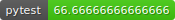

# 🎮 NPC-Engine 🚀

NPC-Engine 是一个由 CogniMatrix™️ 提供的游戏AI引擎，它赋予游戏AI以群体智能。




## 📦 安装

安装方式将在稍后提供。

## 📅 项目时间表

以下是我们的项目开发时间表：

1. 工程化代码[✅]
2. 完成测试用例[WIP]
3. NPC决策[✅]
4. 添加单人对话[❌]
5. 完善文档[WIP]

请继续关注我们的项目，以获取最新的进展和更新！

## 文档

### 使用方式
#### 启动
引擎可以使用对应平台的**运行脚本**(windows下是.bat)或者手动使用**python src/engine.py**运行。

#### 端口
引擎启动后，会在8199(默认)端口监听游戏发过来的UDP包。
unity(或其他需要群体AI的应用程序)发送UDP包到引擎8199端口。
引擎会发送处理后的信息到8084(默认)端口。

#### 项目结构与引擎配置
#### 项目结构
- python_lib(依赖库)
- code
  - npc-engine\
    - logs\(运行日志)
    - src\(源代码)
      - config\(配置文件)
        - action\(场景中允许的动作配置文件)
        - npc\(npc描述配置文件)
        - knowledge\(知识、场景配置文件)
          - game_world.json(基础场景入口配置文件)
          - scenes\(子场景配置文件)
            - xxxx.json(具体场景配置文件)
 
release中code存储项目代码，python_lib存储python依赖库。
npc-engine\logs 存储着每次运行的日志文件
npc-engine\src\config 存储着NPC人物、场景、动作的配置文件。
#### 引擎配置
项目通过“配置文件”+“UDP”包的方式进行交互操作。

init包发送的时候，会读取game_world.json和scene_name.json，然后初始化场景。
game_world.json中包含了所有场景的入口，scene_name.json中包含了具体场景的配置信息。
如果init包中指定了npc，那么会在game_world.json+scene_name.json的基础上添加npc。

注意每个场景都要求action.json和npc.json，如果不存在指定npc就会报错。

NPC的行动是通过action包的交互实现的。
初始化引擎后什么都不会发生，只是把npc加载到了引擎里；
游戏端需要对每个npc发送wakeup包让其产生思维并返回action包。
(长时间没有行为的npc需要游戏端自行检测，发送wakeup包到引擎)
游戏端执行对应的action包之后，需要发送action_done包到引擎，这样引擎才会继续生成npc下一步行为。


### 数据包格式记录
https://aimakers.atlassian.net/wiki/spaces/npcengine/pages/3735735/NPC
#### 引擎初始化：
在游戏场景初始化加载的时候发送给engine，需要指定加载的场景json
```python
{
    "func":"init",
    # 必填字段，代表在什么场景初始化
    "scene":"default_village",
    "language":"E" or "C",
    # 下面是🉑️选
    "npc":[
        {
            "name":"李大爷",
            "desc":"是个好人",
            "mood":"正常",
            "location":"李大爷家",
            "memory":[ ]
        },
        {"name":"王大妈",
        "desc":"是个好人",
        "mood":"焦急",
        "location":"王大妈家",
        "memory":[ ]
        }], # 可以留空，默认按照game_world.json+scene.json初始化场景NPC。非空则在之前基础上添加。
}
```

#### NPC自主行为:
NPC不会开始自主行动，除非你发送了wakeup包给它。
npc-engine接到wakeup包之后，会返回action行为。
游戏这边需要执行对应action，执行最终状态以action_done的形式返回给npc-engine
engine接收到action_done包之后会继续返回action行为包。

```python
# wakeup包例：
{
    "func":"wake_up",
    "npc_name": "王大妈",
    "position": "李大爷家",
    "observation": ["李大爷", "椅子#1","椅子#2","椅子#3[李大爷占用]","床"]
    "time": "2021-01-01 12:00:00", # 游戏世界的时间戳 
}

# action_done包
{
    "func":"action_done",
    "npc_name":"王大妈",
    "status": "success",
    "time": "2021-01-01 12:00:00", # 游戏世界的时间戳

    "observation": ["李大爷", "村长", "椅子#1","椅子#2","椅子#3[李大爷占用]",床], # 本次动作的观察结果
    "position": "李大爷家", # NPC的位置
    "action":"mov",
    "object":"李大爷家",
    "parameters":[],
    "reason": "", # "王大妈在去往‘警察局’的路上被李大爷打断"
}
        
# action_done、wakeup发给游戏包后返回的ACTION包
{
    "name":"action",
    "npc_name":"李大妈",
    "action":"mov",
    "object":"李大爷家",
    "parameters":[],
}
```

#### 对话相关行为：
游戏需要自己确认npc的群体对话触发机制，通常是一个包含固定半径的对话房间。
发送create_conversation给engine后，engine会根据提供的参数返回一个长剧本包，游戏需要自己实现剧本演出。
每一行剧本演出完成后，需要发送确认包给engine否则不会有记忆。

剧本有插入功能，比如玩家要插入对话或者一个新的npc进入了对话，这时候发送re_create_conversation包便可，会重新生成一个考虑到插入npc的接续剧本。

```python
# create_conversation游戏端发给引擎的包
{
    "func": "create_conversation",
    "npc": "{npc}",
    "location": "{location}",
    "topic": "{topic}",
    "observations": "{observations}",
    "starting": "{starting}",
    "player_desc": "{player_desc}",
    "memory_k": "{memory_k}",
    "length": "{length}"
}

# 引擎端创造并生成剧本后传给游戏端的数据包
{
    "name": "conversation",
    "id": "{id}",
    "length": "{length}",
    "location": "{location}",
    "lines": "{lines}"
}

# 引擎端生成剧本的每一行的格式
{
    "type": "{type}",
    "state": "{state}",
    "name": "{name}",
    "mood": "{mood}",
    "words": "{words}",
    "action": "{action}"
}

# 游戏端传给引擎端的剧本演示确认包
{
    "func": "confirm_conversation_line",
    "conversation_id": "{id}",
    "index": "{index}"
}

# re_create_conversation游戏端发给引擎的包
{
    "func": "re_create_conversation",
    "id": "{id}",
    "character": "{character}",
    "interruption": "{interruption}",
    "player_desc": "{player_desc}",
    "length": "{length}"
}

```

## 测试方式

### NPC_ACTION测试参考代码:
1.test_npc_action.py
运行这个脚本然后查看logs/下的日志
2.test_npc_action.ipynb
运行CELL然后查看logs/下的日志，可以自定义自己的包。
上面的代码仅供参考，可以自己写一个脚本来测试。
在npc_engine父目录中import npc_engine 然后 engine = NPCEngine() 就可以启动。


## 版本发布

### 打包方式

项目使用pyarmor加密，然后在windows中使用嵌入式的python执行engine.py。

打包脚本为npc_engine/dist/release_windows.sh

打包后可运行的windows项目在npc_engine/dist/release/windows_ver，其中脚本start_engine.bat用来启动engine


