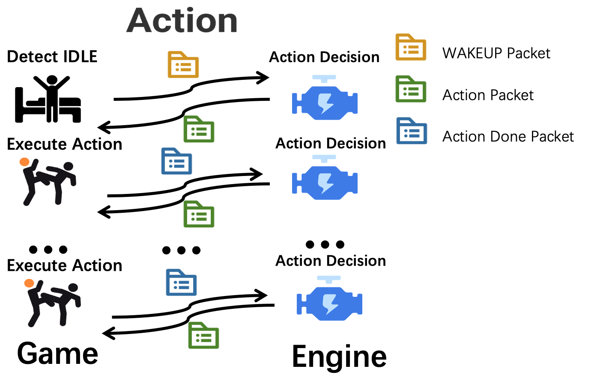

## NPC Action模块简述

NPC不会开始自主行动，除非你发送了wakeup包给它。
npc-engine接到wakeup包之后，会返回action行为数据包。
游戏端需要执行对应action，执行最终状态以action_done的形式返回给npc-engine,
engine接收到action_done包之后会继续返回action行为包。

## Action模块UDP请求例
```python
# wakeup包例：
{
    "func":"wake_up",
    "npc_name": "王大妈",
  
    "scenario_name": "李大爷家", 
    "npc_state": {
      "position": "李大爷家卧室",
      "observation": {
              "people": ["李大爷", "村长", "李飞飞"],
              "items": ["椅子#1","椅子#2","椅子#3[李大爷占用]","床"],
              "locations": ["李大爷家大门","李大爷家后门","李大爷家院子"]
                    },
      "backpack":["优质西瓜", "大砍刀", "黄金首饰"]
    },

    "time": "2021-01-01 12:00:00", # 游戏世界的时间戳 
}

# action_done包例
{
    "func":"action_done",
    "npc_name":"王大妈",
    "status": "success",
    "time": "2021-01-01 12:00:00", # 游戏世界的时间戳
  
    "scenario_name": "李大爷家", 
    "npc_state": {
      "position": "李大爷家卧室",
      "observation": {
              "people": ["李大爷", "村长", "李飞飞"],
              "items": ["椅子#1","椅子#2","椅子#3[李大爷占用]","床"],
              "locations": ["李大爷家大门","李大爷家后门","李大爷家院子"]
                    },
      "backpack":["优质西瓜", "大砍刀", "黄金首饰"]
    },

    "action":"mov",
    "object":"李大爷家",  # 之前传过来的动作对象
    "parameters":[], # 之前传过来的参数
    "reason": "", # "王大妈在去往‘警察局’的路上被李大爷打断"
}
```
### Action模块响应数据包例：
```python
# action_done、wakeup发给游戏包后返回的ACTION包
{
    "name":"action",
    "npc_name":"李大妈",
    "action":"mov",
    "object":"李大爷家",
    "parameters":[],
}
```