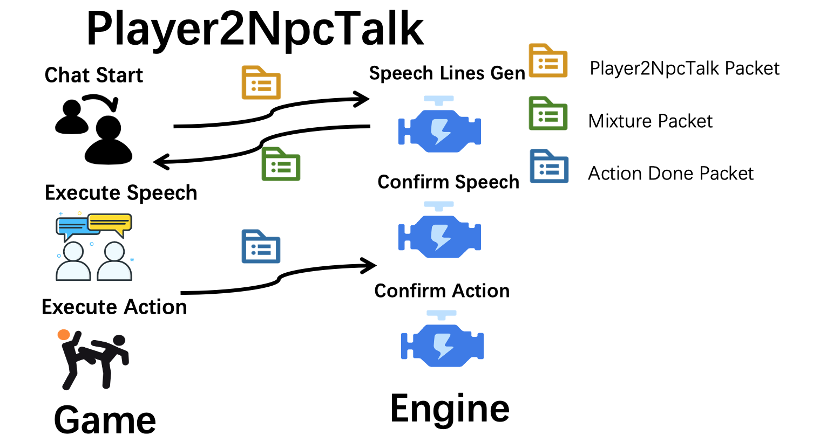

## Player2NPC Talk模块简述

玩家可以通过talk模块与NPC进行对话，对话的内容仅支持文字。
开发者在的到玩家的文字输入后，整合UDP[对话包](./talk.md#talk模块udp请求例)，发送给npc-engine，
npc-engine会返回该NPC的回答、动作调用的[复合包](./talk.md#talk模块响应数据包)。
目前，该功能还不支持流响应。请求返回时间大概在2-5秒左右，引入流响应后，可以将返回时间缩短到1秒以内。

engine会返回一个包含action和answer的[对话包](./talk.md#talk模块udp请求例)给游戏端，游戏端可自行决定是否发送[action_done包](./action.md#actiondone包例)给engine(本模块记忆不需要发送确认包来添加)。

## Talk模块UDP请求例
```python
# player2npc的对话包
player2npc_packet = {
    "func":"talk2npc",
    "npc_name":"警员1",
    "time": "2021-01-01 12:00:00", # 游戏世界的时间戳

    # NPC的状态
    "scenario_name": "警察局",
    "npc_state": {
      "position": "雁栖村入口",
      "observation": {
              "people": ["囚犯阿呆","警员2","旅行者小王"],
              "items": ["椅子#1","椅子#2","椅子#3[李大爷占用]","床"],
              "locations": ['牢房', '雁栖村入口']
                    },
      "backpack":["优质西瓜", "大砍刀", "黄金首饰"]
    },
    # player的信息
    "player_name":"旅行者小王",  # player的名字
    "speech_content":"你好，我是旅行者小王, 我要报警, 在林区中好像有人偷砍树",  # player说的话
    "items_visible": ["金丝眼镜", "旅行签证", "望远镜"],  # player身上的物品
    "state": "旅行者小王正在严肃地站着，衣冠规整，手扶着金丝眼镜",  # player状态的自然语言描述，开发者可以随意添加
}

# action_done包例
{
    "func":"action_done",
    "npc_name":"王大妈",
    "status": "success",
    "time": "2021-01-01 12:00:00", # 游戏世界的时间戳
  
    "scenario_name": "李大爷家", 
    "npc_state": {
      "position": "李大爷家卧室",
      "observation": {
              "people": ["李大爷", "村长", "李飞飞"],
              "items": ["椅子#1","椅子#2","椅子#3[李大爷占用]","床"],
              "locations": ["李大爷家大门","李大爷家后门","李大爷家院子"]
                    },
      "backpack":["优质西瓜", "大砍刀", "黄金首饰"]
    },

    "action":"mov",
    "object":"李大爷家",  # 之前传过来的动作对象
    "parameters":[], # 之前传过来的参数
    "reason": "", # "王大妈在去往‘警察局’的路上被李大爷打断"
}
```
## Talk模块响应数据包
```python
{"name": "talk_result", 
 "npc_name": "警员1",  # NPC 名字 
 "answer": "旅行者小王，请跟我来，我需要你协助我前往林区查看。",  # NPC 回答
 "actions": [{"action": "mov", "object": "林区", "parameters": "", "npc_name": "警员1"}] # NPC动作调用(开发者可选择性使用)
 }
```