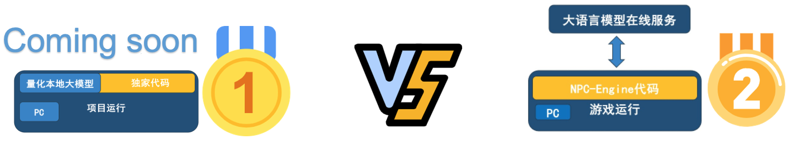

# Nuwa-Engine

Nuwa(女娲) 是一个由 [CogniMatrix](http://www.cognimatrix.games/)™️ 提供的游戏AI引擎，将Nlp技术和游戏工业结合，赋予游戏NPC以自然语言驱动的智能表现。


[](https://docs.cognimatrix.games/nuwa_doc/)
[](https://discord.com/channels/1159008679308308480/1159008679308308483)
[](https://nuwa-release.s3.us-west-2.amazonaws.com/index.html)

## **引擎简介**
CogniMatrix™️ [女娲](https://github.com/casia22/npc-engine) 是一个解耦地通过[UDP数据包](./tutorials/engine.md#udp)传输来为游戏NPC提供[对话](./modules/conversation.md)、[动作决策功能](./modules/action.md)的组件。

其设计理念是：**"低成本，本地化“**。

我们希望通过最小的成本，[最简单的配置](./tutorials/engine.md#11-引擎配置)，最快的部署，来实现一个可以用于单机游戏、社会模拟、数字员工等多种场景的NPC引擎。

Nuwa针对商业项目提供了[商业授权](http://www.cognimatrix.games/)，非盈利项目免费。

## **项目阶段**
##### 方案1⃣️: 线上API模式(已实现)
线上API模式会产生一定延迟和持续的费用，这对于单机游戏来说是难以接受的。
但是这种模式对配置要求较低，不会占用额外的GPU资源，可以用于快速验证引擎的功能和轻量RPG游戏。

##### 方案2⃣️: 本地化模式(开发中)
本地化模式会在本地运行若干小LLM，针对不同级别的NPC调用进行负载均衡。
不会产生任何网络调用，但对配置要求较高，且本地LLM效果不如线上LLM。

##### 方案3⃣️: 混合模式(开发中)
混合模式中，本地LLM、线上LLM和历史缓存都会被用于NPC的行为决策，以达到最佳的性能、体验、成本的均衡。


## **下载/安装**
[Nuwa引擎](https://nuwa-release.s3.us-west-2.amazonaws.com/index.html)免安装，运行nuwa、nuwa.exe或通过代码拉起nuwa即可。
```shell
## 命令行 ##
##mac/linux##
./nuwa
##windows##
./nuwa.exe
```
您只需在项目目录(./project)中进行自定义配置即可满足您定制化需要

## **项目进展**

### 🚀 **开发进度**：

- [x] 🔨 工程化代码
- [x] 🤖 NPC决策
- [x] 💬 添加单人对话
- [x] 📝 完善文档 (进行中)
- [x] 🗃️ 本地向量数据库
- [x] 🧠 本地embedding模型
- [ ] 🧪 完成测试用例 (进行中)
- [ ] 💡 添加基于embedding搜索的action决策
- [ ] 🔄 场景切换的大模型功能

### 🎉 **项目里程碑**

- 🗓️ 2023年6月: 项目开始，实现对话房间功能
- 🗓️ 2023年7/8月: 实现NPC action功能
- 🎈 2023年9月16日: DEMO小镇运行成功，代码初步可用
- 🗓 2023年10月4日: 项目文档✅
- 🗓 2023年12月28日: 开放公共下载

### 🏆 **获得荣誉**

- 🥈 2023年8月: 获得国科大创新创业大赛二等奖
- 🎖️ 2023年9月: 获得面壁智能hackthon挑战赛优胜奖
- 🎖 2023年12月: 获得清华大模型应用创新挑战赛二等奖

🔔 请持续关注我们的项目，以获取最新的进展和更新！
