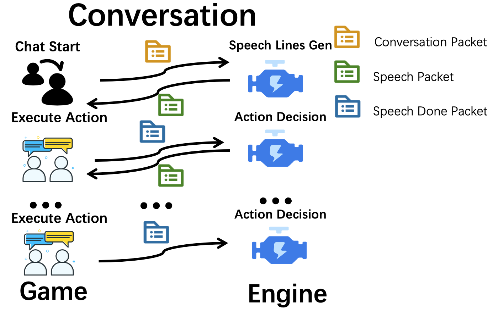

## Conversation模块简述



游戏需要自己确认npc的群体对话触发机制，通常是一个包含固定半径的对话房间。
发送create_conversation给engine后，engine会根据提供的参数返回对话剧本
游戏端通过设置stream参数来控制对话剧本生成的模式：
    其一是生成完整剧本，将整个剧本打包成大数据包并一次性传给游戏端（stream = False）
    其二是生成流式剧本、每行剧本打包成一个数据包并持续传送给游戏端（stream = True）
对话剧本的每一行在游戏端演出完成后，需要发送确认包给engine。

对话剧本允许插话，玩家如果要插入对话或者一个新的npc进入了对话，这时候发送re_create_conversation包(带着之前的对话ID)便可，会重新生成一个考虑到插入npc的接续剧本。

## Conversation模块UDP包
```python
# create_conversation游戏端发给引擎的包
{
    "func": "create_conversation",
    "npc": ["王大妈","李大爷"],   # npc列表

    "scenario_name": "李大爷家",        
    "location": "李大爷家卧室",
    "topic": "王大妈想要切了自己的西瓜给李大爷吃，并收钱", # 可以留空，会自动生成topic
    "npc_states": [   # 该列表中的每个状态对应于npc列表的相应角色名称
                {
                  "position": "李大爷家",
                  "observation": {
                          "people": ["李大爷", "村长", "隐形李飞飞"],
                          "items": ["椅子#1","椅子#2","椅子#3[李大爷占用]","床"],
                          "locations": ["李大爷家大门","李大爷家后门","李大爷家院子"]
                                },
                  "backpack":["优质西瓜", "大砍刀", "黄金首饰"]
                },
                {
                  "position": "李大爷家",
                  "observation": {
                          "people": ["王大妈", "村长", "隐形李飞飞"],
                          "items": ["椅子#1","椅子#2","椅子#3[李大爷占用]","床"],
                          "locations": ["李大爷家大门","李大爷家后门","李大爷家院子"]
                                },
                  "backpack":["黄瓜", "1000元", "老报纸"]
                },
                ],
    "starting": "你好，嫩们在干啥腻？",  # 玩家说的话，可选留空
    "player_desc": "玩家是一个疯狂的冒险者，喜欢吃圆圆的东西",  # 玩家的描述，可选留空
    "memory_k": 3,  # npc的记忆检索条数，必须填写
    "length": "P"  # 可以选择的剧本长度模式，S M L X P 可选，分别是短剧本、中剧本、长剧本、超长剧本、精简剧本（短≠精简）
    "stream": True  # 是否采用流式响应
}

# 引擎端生成完整剧本传给游戏端的数据包
{
    "name": "conversation",
    "mode": "script",  # 对话传输剧本模式的数据包
    "id": "123456789",  # conversation对象的索引号
    "location": "李大爷家",  # 对话发生所在的地点
    "lines": [line1, line2, line3, line4, ...]  # 剧本信息，由若干行对话组成的序列
}

# 引擎端生成流式剧本传给游戏端的单个数据包
{
    "name": "conversation",
    "mode": "line",   # 对话传输剧本行模式的数据包
    "id": "123456789",  # conversation对象的索引号
    "location": "李大爷家",  # 对话发生所在的地点
    "index": 2,  # 剧本行所在的索引号
    "one_line": line  # 一行剧本的信息
}


# 引擎端生成剧本的每一行的格式
{
    "type": "Interaction",  # 剧本行的类型，可以是State，Interaction，Error
    "state": "李大爷退出。剩下的角色：王大妈",  # 当剧本行类型是State和Error时，"state"才会有具体内容
    "name": "李大爷",  # 剧本行对应的角色姓名，当剧本行类型是Interaction时才不为空
    "mood": "开心",  # 剧本行对应角色的情绪，当剧本行类型是Interaction时才不为空
    "words": "我喜好吃西瓜",  # 剧本行对应角色的说话内容，当剧本行类型是Interaction时才不为空
    "action": {
              "type": "对话",
              "args": "王大妈"}  # 剧本行对应角色的动作，当剧本行类型是Interaction时不为空
}

# 游戏端传给引擎端的剧本演示确认包
{
    "func": "confirm_conversation_line",
    "conversation_id": "123456789",  # conversation对象的索引号
    "index": 2,  # 游戏端展示完成的剧本行索引号
}

# re_create_conversation游戏端发给引擎的包
{
    "func": "re_create_conversation",
    "id": "123456789",  # conversation对象的索引号
    "character": "警长",  # 新加入角色的名称
    "interruption": "大家好呀，你们刚刚在说什么",  # 玩家插入的说话内容
    "player_desc": "玩家是一个疯狂的冒险者，喜欢吃圆圆的东西",  # 玩家的描述，可选留空
    "length": "P"  # 可以选择的剧本长度模式，S M L X P 可选，分别是短剧本、中剧本、长剧本、超长剧本、精简剧本（短≠精简）
    "stream": True  # 是否采用流式响应
}
```