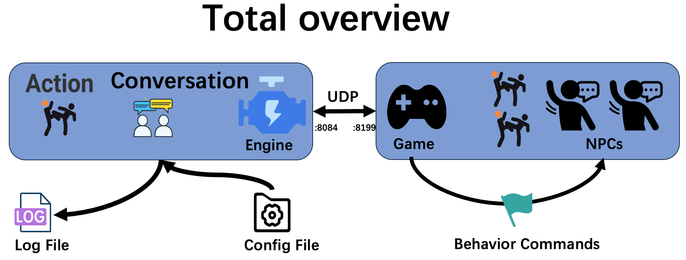
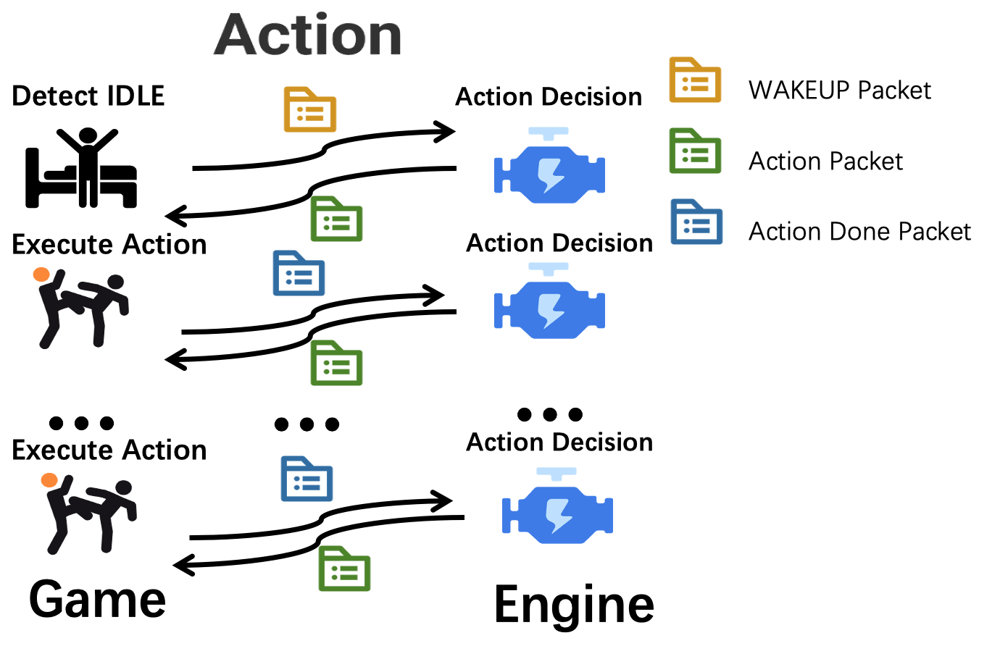
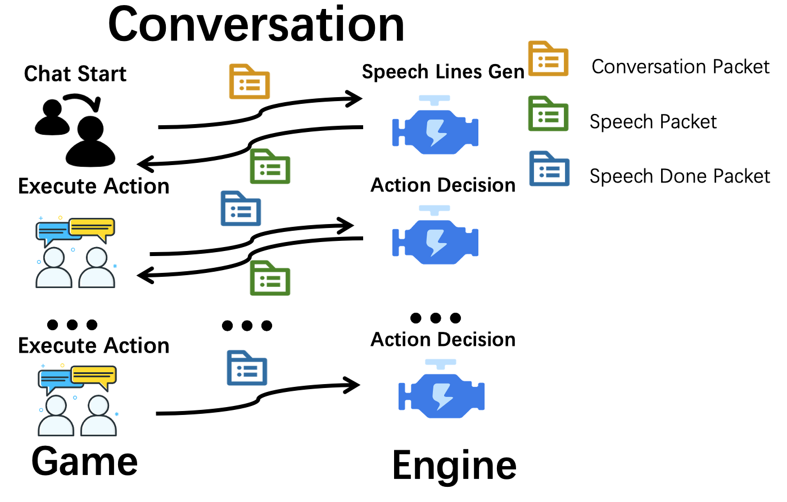

## 📜引擎使用说明



### nuwa的开发流程
- [引擎配置](#1.1 引擎配置)
- [启动引擎](#1.2 引擎启动)
- [UDP请求](#udp)
- [关闭引擎](#1.4 引擎关闭)

## 1.1 引擎配置
在使用之前，开发者需要更新维护引擎的配置文件，配置文件位于**nuwa/Config**文件夹中，包括：

- OpenAI API的配置文件: project/config/openai_config.json 
- [动作配置文件](action.md#action配置例): project/config/action/your_action_XXX.json
- [NPC配置文件](npc.md#配置文件初始化): project/config/npc/your_npc_nameXXX.json
- [场景配置文件](scenario.md#scenario配置方法): project/config/knowledge/scenes/your_scenario_nameXXX.json

## 1.2 引擎启动
引擎可以使用对应平台的[**发行版**](https://nuwa-release.s3.us-west-2.amazonaws.com/index.html)，通过脚本或程序执行./nuwa来拉起引擎。


## 1.3 引擎交互
引擎端和游戏端通过UDP数据包按照[UDP数据包格式](#udp)进行交互，引擎端默认在8199端口监听游戏端数据包，游戏端默认在8084端口监听引擎端数据包。

## 1.4 引擎关闭
游戏端通过发送“close”功能数据包给引擎端来请求关闭引擎（详见[数据包](#udp)）。


## ✨配置文件结构
## 2.1 项目目录结构
- dist(项目代码)
  - nuwa.exe (引擎执行入口) 
  - project\
    - logs\(运行日志)
    - src\(源代码)
      - config\(配置文件)
        - action\(场景中允许的动作配置文件)
          - chat.json\(自定义第一个动作的配置文件)
          - ...
        - npc\(npc描述配置文件)
          - 村长.json\(自定义第一个角色的配置文件)
          - ...
        - knowledge\(知识、场景配置文件)
          - scenes\(子场景配置文件)
            - 警察局.json(自定义第一个具体场景的配置文件)
            - ...

## 🎒UDP数据包

## 3.1 场景初始化数据包
在引擎初始化或者加载一个新场景的时候，游戏端需要先发送init数据包给引擎端。引擎端才会加载指定场景的NPC。

```python
# 场景初始化的包
{
    "func":"init",   # 表示该传送的数据包是用于加载场景
    # 必填字段
    "scene_name":"雁栖村",   # 加载场景的名称，代表在什么场景下初始化
    "language":"C",   # 选择语言版本，“E”表示英文，“C”表示中文。默认且推荐使用中文。
    # 🉑️选字段
    "npc":[
        {
            "name":"李大爷",
            "desc":"是个好人",
            "npc_state": {
                  "position": "李大爷家",
                  "observation": {
                          "people": ["王大妈", "村长", "隐形李飞飞"],
                          "items": ["椅子#1","椅子#2","椅子#3[李大爷占用]","床"],
                          "locations": ["李大爷家大门","李大爷家后门","李大爷家院子"]
                                },
                  "backpack":["黄瓜", "1000元", "老报纸"]
                       },
            "mood":"正常",
            "action_space": ["mov", "chat"],  # 人物的动作空间(在实际执行的时候，场景的all_actions和人物action_space取交集) 
            "memory":[ ]
        },
        {
            "name":"王大妈",
            "desc":"是个好人",
            "npc_state": {
                  "position": "李大爷家",
                  "observation": {
                          "people": ["李大爷", "村长", "隐形李飞飞"],
                          "items": ["椅子#1","椅子#2","椅子#3[李大爷占用]","床"],
                          "locations": ["李大爷家大门","李大爷家后门","李大爷家院子"]
                                },
                  "backpack":["优质西瓜", "大砍刀", "黄金首饰"]
                       },
        "mood":"焦急",
        "action_space": ["mov", "chat"],  # 人物的动作空间(在实际执行的时候，场景的all_actions和人物action_space取交集)
        "memory":[ ]
        }], # 可以留空，默认按照scene.json初始化场景NPC。非空则在之前基础上添加。
}
```

## 3.2 引擎关闭数据包
在游戏结束的时候，engine需要一个close数据包，用于更新所有NPC的状态到json文件中。
```python
# 引擎关闭的包
{
    "func":"close" # 关闭引擎,并保存所有NPC到json
}
```

## 3.3 NPC的动作数据包
NPC不会开始自主行动，除非你发送了wakeup包给它。
npc-engine接到wakeup包之后，会返回action行为数据包。
游戏端需要执行对应action，执行最终状态以action_done的形式返回给npc-engine
engine接收到action_done包之后会继续返回action行为包。




```python
# wakeup包例：
{
    "func":"wake_up",
    "npc_name": "王大妈",
  
    "scenario_name": "李大爷家", 
    "npc_state": {
      "position": "李大爷家卧室",
      "observation": {
              "people": ["李大爷", "村长", "李飞飞"],
              "items": ["椅子#1","椅子#2","椅子#3[李大爷占用]","床"],
              "locations": ["李大爷家大门","李大爷家后门","李大爷家院子"]
                    },
      "backpack":["优质西瓜", "大砍刀", "黄金首饰"]
    },

    "time": "2021-01-01 12:00:00", # 游戏世界的时间戳 
}

# action_done包例
{
    "func":"action_done",
    "npc_name":"王大妈",
    "status": "success",
    "time": "2021-01-01 12:00:00", # 游戏世界的时间戳
  
    "scenario_name": "李大爷家", 
    "npc_state": {
      "position": "李大爷家卧室",
      "observation": {
              "people": ["李大爷", "村长", "李飞飞"],
              "items": ["椅子#1","椅子#2","椅子#3[李大爷占用]","床"],
              "locations": ["李大爷家大门","李大爷家后门","李大爷家院子"]
                    },
      "backpack":["优质西瓜", "大砍刀", "黄金首饰"]
    },

    "action":"mov",
    "object":"李大爷家",  # 之前传过来的动作对象
    "parameters":[], # 之前传过来的参数
    "reason": "", # "王大妈在去往‘警察局’的路上被李大爷打断"
}
        
# action_done、wakeup发给游戏包后返回的ACTION包
{
    "name":"action",
    "npc_name":"李大妈",
    "action":"mov",
    "object":"李大爷家",
    "parameters":[],
}
```

## 3.4 对话相关行为
游戏需要自己确认npc的群体对话触发机制，通常是一个包含固定半径的对话房间。
发送create_conversation给engine后，engine会根据提供的参数返回一个长剧本包，游戏需要自己实现剧本演出。
每一行剧本演出完成后，需要发送确认包给engine否则不会有记忆。

剧本有插入功能，比如玩家要插入对话或者一个新的npc进入了对话，这时候发送re_create_conversation包(带着之前的对话ID)便可，会重新生成一个考虑到插入npc的接续剧本。



```python
# create_conversation游戏端发给引擎的包
{
    "func": "create_conversation",
    "npc": ["王大妈","李大爷"],   # npc列表

    "scenario_name": "李大爷家",        
    "location": "李大爷家卧室",
    "topic": "王大妈想要切了自己的西瓜给李大爷吃，并收钱", # 可以留空，会自动生成topic
    "npc_states": [   # 该列表中的每个状态对应于npc列表的相应角色名称
                {
                  "position": "李大爷家",
                  "observation": {
                          "people": ["李大爷", "村长", "隐形李飞飞"],
                          "items": ["椅子#1","椅子#2","椅子#3[李大爷占用]","床"],
                          "locations": ["李大爷家大门","李大爷家后门","李大爷家院子"]
                                },
                  "backpack":["优质西瓜", "大砍刀", "黄金首饰"]
                },
                {
                  "position": "李大爷家",
                  "observation": {
                          "people": ["王大妈", "村长", "隐形李飞飞"],
                          "items": ["椅子#1","椅子#2","椅子#3[李大爷占用]","床"],
                          "locations": ["李大爷家大门","李大爷家后门","李大爷家院子"]
                                },
                  "backpack":["黄瓜", "1000元", "老报纸"]
                },
                ],
    "starting": "你好，嫩们在干啥腻？",  # 玩家说的话，可选留空
    "player_desc": "玩家是一个疯狂的冒险者，喜欢吃圆圆的东西",  # 玩家的描述，可选留空
    "memory_k": 3,  # npc的记忆检索条数，必须填写
    "length": "M"  # 可以选择的剧本长度，S M L X 可选。 
}

# 引擎端创造并生成剧本后传给游戏端的数据包
{
    "name": "conversation",
    "id": "123456789",  # conversation对象的索引号
    "length": "M",  # 可以选择的剧本长度，S M L X 可选。 
    "location": "李大爷家",  # 对话发生所在的地点
    "lines": [line1, line2, line3, line4, ...]  # 剧本信息，由若干行对话组成的序列
}

# 引擎端生成剧本的每一行的格式
{
    "type": "Interaction",  # 剧本行的类型，可以是State，Interaction，Error
    "state": "李大爷退出。剩下的角色：王大妈",  # 当剧本行类型是State和Error时，"state"才会有具体内容
    "name": "李大爷",  # 剧本行对应的角色姓名，当剧本行类型是Interaction时才不为空
    "mood": "开心",  # 剧本行对应角色的情绪，当剧本行类型是Interaction时才不为空
    "words": "我喜好吃西瓜",  # 剧本行对应角色的说话内容，当剧本行类型是Interaction时才不为空
    "action": {
              "type": "对话",
              "args": "王大妈"}  # 剧本行对应角色的动作，当剧本行类型是Interaction时不为空
}

# 游戏端传给引擎端的剧本演示确认包
{
    "func": "confirm_conversation_line",
    "conversation_id": "123456789",  # conversation对象的索引号
    "index": 2,  # 游戏端展示完成的剧本行索引号
}

# re_create_conversation游戏端发给引擎的包
{
    "func": "re_create_conversation",
    "id": "123456789",  # conversation对象的索引号
    "character": "警长",  # 新加入角色的名称
    "interruption": "大家好呀，你们刚刚在说什么",  # 玩家插入的说话内容
    "player_desc": "玩家是一个疯狂的冒险者，喜欢吃圆圆的东西",  # 玩家的描述，可选留空
    "length": "M"  # 可以选择的剧本长度，S M L X 可选。 
}

```
## 👮‍引擎交互注意事项

- 游戏端发送init包后，引擎端会读取数据包中场景名称所对应的配置文件scene_name.json，然后初始化场景。
- 如果init数据包中包含npc信息，那么引擎端会默认从该数据包中读入角色信息；如果不包含，则引擎端会从scene_name.json配置文件中读入角色信息。
- 每个场景配置文件scene_name.json中的可支持动作和存在的角色名称都需要在\action和\npc中进行定义，如果未定义则会报错。
- 每个npc在游戏中的自主行动需要游戏端对针对该角色向引擎端发送wakeup包来实现的。
 - 长时间没有自主行为的npc**需要游戏端自行检测**，发送wakeup包到引擎进行再次唤醒
 - 引擎端接收wakeup包后会生成npc的动作并返回action包给游戏端
 - 游戏端执行对应的action包之后，需要发送action_done包到引擎，这样引擎才会继续生成npc下一步行为。
